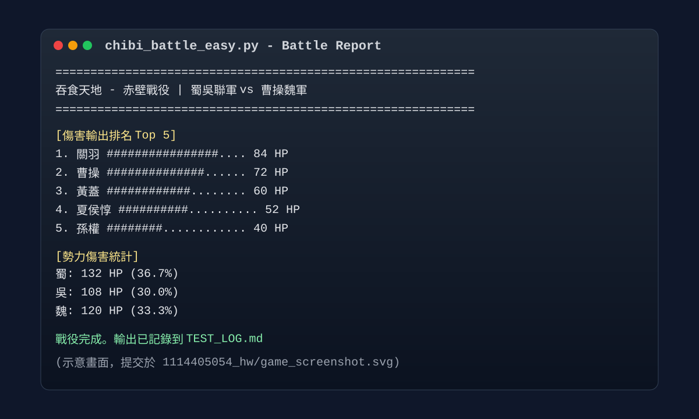

# AI 使用說明

## 遊戲畫面截圖

## 我怎麼使用 AI

1. 先閱讀 week-07 的 HOMEWORK.md，整理出必做功能：檔案 I/O、EOF、namedtuple、sorted、Counter、defaultdict、TDD。
2. 請 AI 協助我建立 week-07/solutions/1114405054_hw 的作業檔案結構與測試骨架。
3. 依需求完成 chibi_battle.py、chibi_battle_easy.py、test_chibi.py，並補上 generals.txt、battles.txt、TEST_LOG.md。
4. 最後用 unittest 執行測試，確認資料讀取、戰鬥邏輯、統計與報告輸出流程都可運作。

## 哪些內容是 AI 幫忙的

- 協助整理程式模組分工。
- 協助補齊測試案例與輸出檢查。
- 協助整理繁體中文註解與操作說明。
- 協助記錄測試執行結果到 TEST_LOG.md。

## 哪些內容是我需要理解的

- namedtuple 怎麼建立武將資料。
- 為什麼 sorted 可以決定出手順序。
- Counter 與 defaultdict 分別在統計什麼。
- 檔案讀取為什麼要遇到 EOF 就停止。
- 如何用 unittest 驗證戰鬥流程。

## 本次作業沒有使用的做法

- 沒有用 any 或忽略型別錯誤的方式硬壓過去。
- 沒有直接修改題目檔或 week-07 說明檔。
- 沒有把作業做成只有畫面展示、無法重跑測試的靜態內容。
